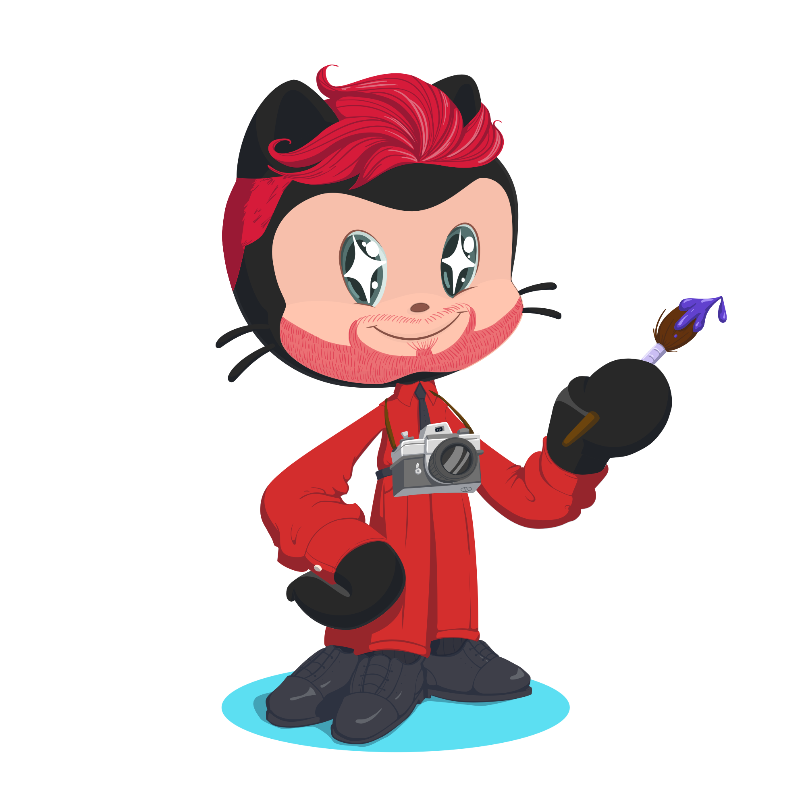

# 👋 Hi, I'm Joseph Dunivan
## 💻 Software Engineer | 🤖 Data Scientist | 🎨 Digital Designer | 🏗️ Experiential Project Manager

Versatile technologist with a passion for creating innovative solutions that blend creativity, code, and immersive experiences. With expertise spanning full-stack development, multimedia production, and experiential event management, I bring a unique perspective to every project.

| 🚀 What I'm all about:    • 🛠️ Developing cutting-edge mobile apps and web applications   • 🎬 Crafting engaging multimedia experiences   • 🏗️ Designing and managing immersive physical and digital spaces   • 🔍 Solving problems with a creative, tech-driven approach |  |
|:---|:---:|

### 🛠️ Tech Stack & Skills:

- **Languages:** JavaScript, TypeScript, Python, R, SQL HTML5, CSS, Dart
- **Frameworks/Libraries/Tools:** Flutter, React, React Native, Angular, Expo, Git, GitHub Actions, Circle CI
- **Design Tools:** Figma, Storybook, Adobe Suite (XD, After Effects, Premiere Pro, Audition, Illustrator)
- **3D & Animation:** Blender, Rive
- **Data Science:** Machine Learning, Data Manipulation and Analysis, Data Visualization, Big Data Technologies, Data Preprocessing and Feature Engineering, Version Control
- **Statistical Analysis:** Probability Theory, Descriptive and Inferential Statistics, Hypothesis Testing, Regression Analysis, Bayesian Statistics 
- **Database & Cloud:** Azure SQL Server, MongoDB, AWS

### 📚 Certifications:

- Certified Project Manager
- Certified Data Scientist (DataCamp)
- Certified Engineer (IBM)

### 🌟 Featured Projects:

1. **Charity Organization Mobile App**
   - React Native with Expo services
   - Custom API integration with PHP backend
   - Twilio services for SMS automation
   - Tailwind CSS for UI development
   - Rive animations for engaging onboarding

2. **Ascendis Pharma Interactive Web App**
   - Angular-based progressive web application
   - 3D virtual expo platform integration
   - Reactive animations for product education

3. **Experiential Event Designs**
   - Conceptualized and executed immersive physical spaces for major conferences
   - Integrated digital elements with physical designs for interactive experiences
   - Managed large-scale projects across multiple venues and outdoor locations

### 🏢 Major Brands & Clients:

As a project manager, I've had the privilege of working with renowned organizations, including:

- Genentech
- Thermo Fisher Scientific
- Tupperware
- Santa Monica Seafood
- DockDirect
- Compass Health
- Ascendis Pharma
- Disney
- eCreative

My role involved creating captivating experiential designs, managing complex event logistics, and delivering innovative solutions that aligned with each brand's unique identity and goals.

### 📫 Let's Connect:

- [LinkedIn](https://www.linkedin.com/in/jdunivan)
- [Portfolio](https://www.datacamp.com/portfolio/joey-dunivan)

## Always open to exciting projects and collaborations. Let's create something immersive and impactful together! 🚀
